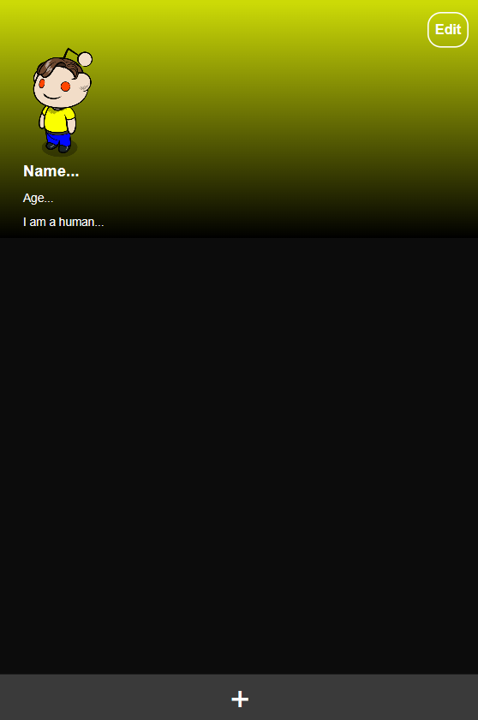
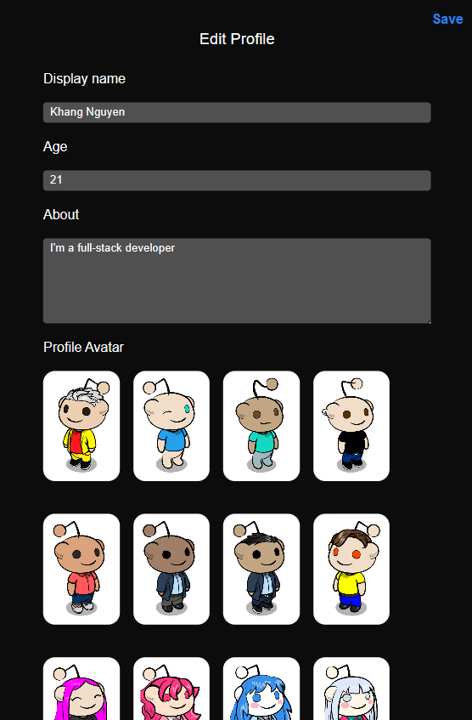
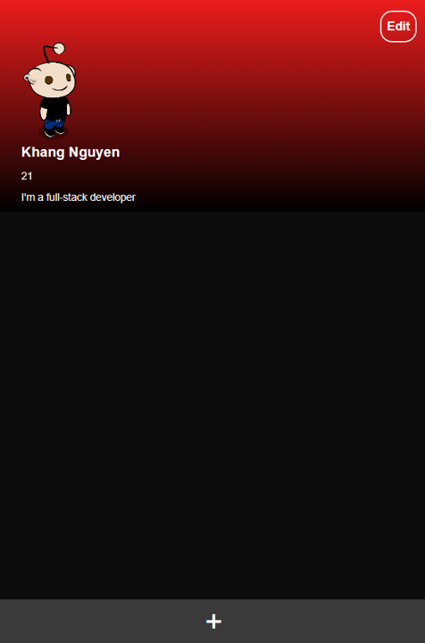
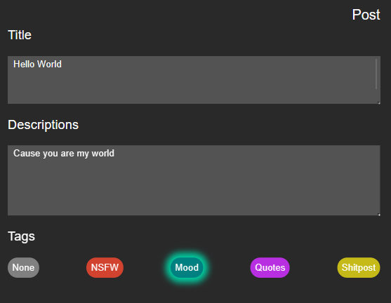
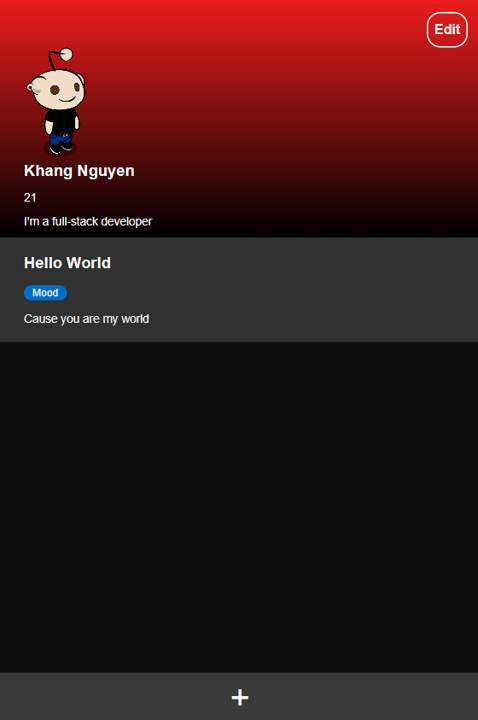

# Simple Reddit Clone

This project is a minimalist Reddit-like web application built with React, JavaScript, and Redux Toolkit. Customize the character's name, theme color, age, description, and avatar to make it your own. Share posts in a straightforward and user-friendly interface.

## User Interface

## Edit

## Successfully

## Post

## Done

## Features

- Customize the character's name, theme color, age, description, and avatar.
- Post content.
- Simple and intuitive user interface.

### Frontend

1. Navigate to the frontend directory: `cd frontend`
2. Install frontend dependencies: `npm install`
3. Run the frontend app locally: `npm start`

### Backend

1. Navigate to the backend directory: `cd backend`
2. Install backend dependencies: `npm install`
3. Run the backend server locally: `npm start`

## Customization

Modify the app's settings by editing the configuration files. Customize the character's name, appearance, age, description, and avatar easily.

## Technologies Used

- React
- JavaScript
- Redux Toolkit
- Express.js
